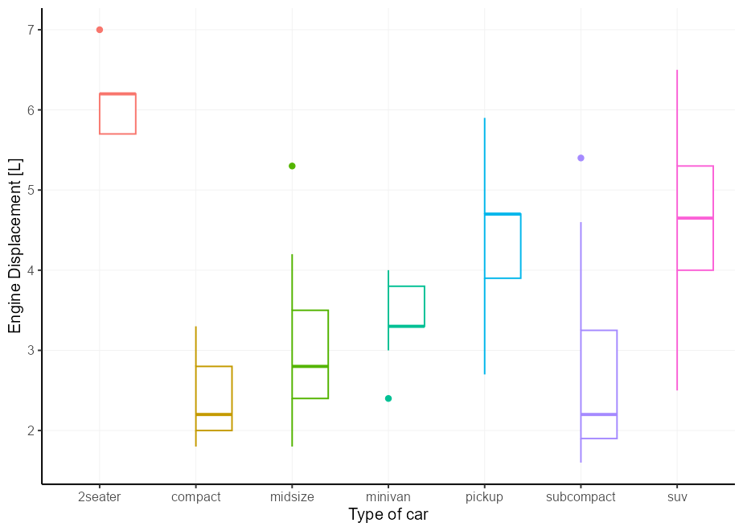
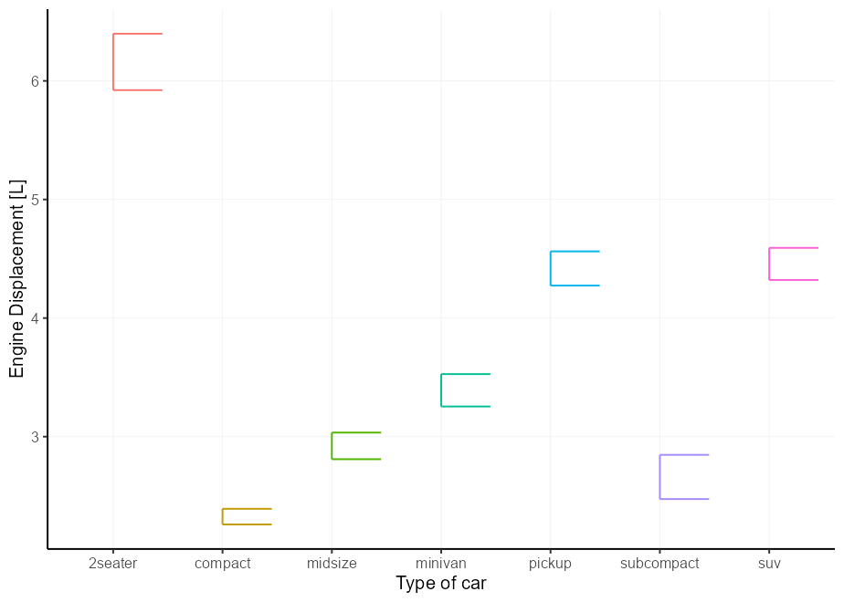
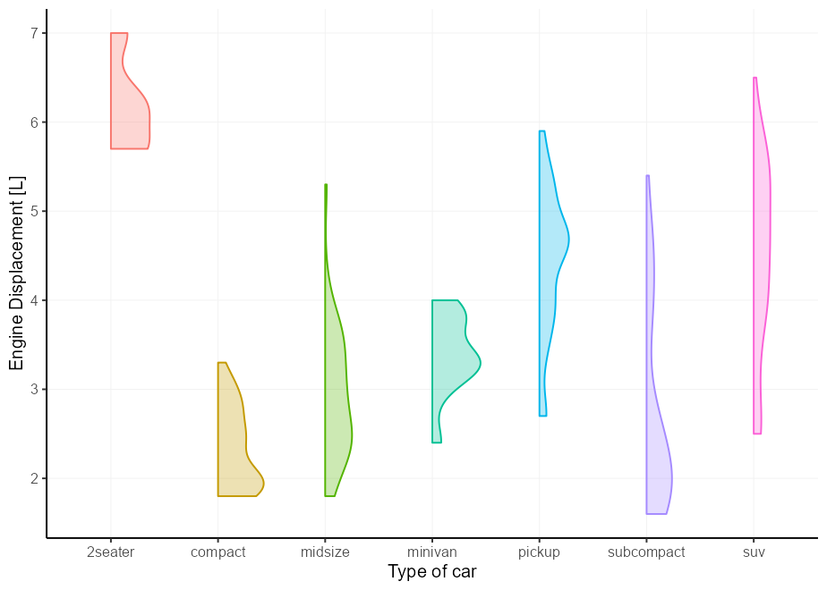
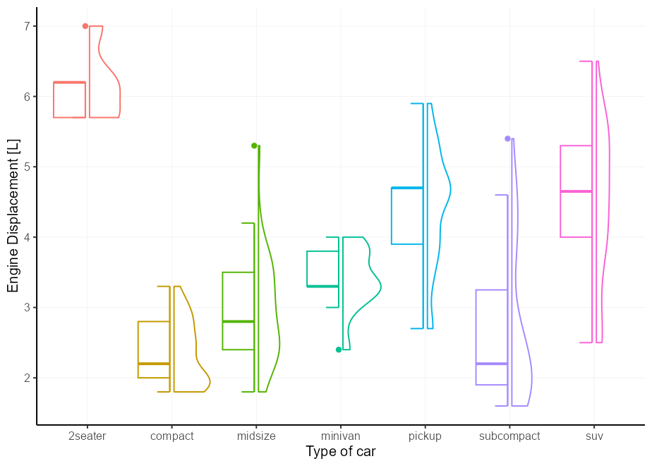
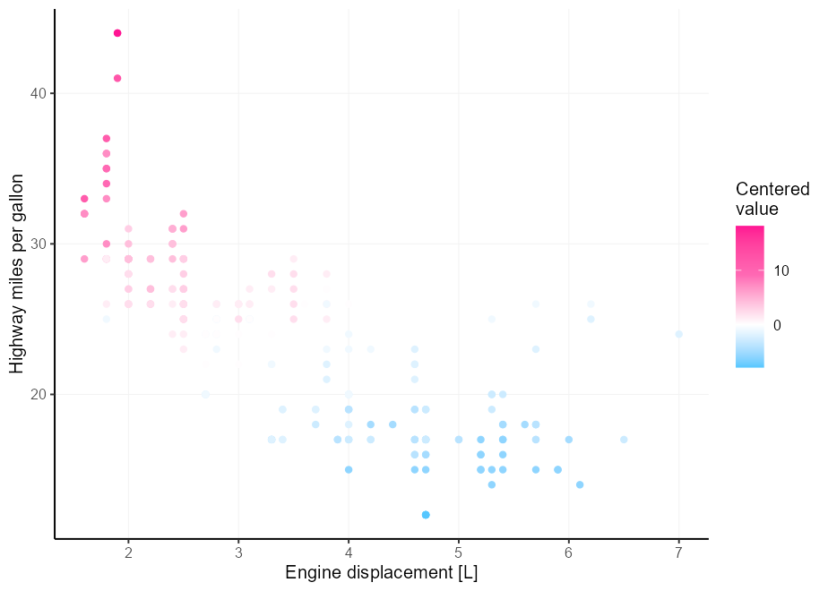
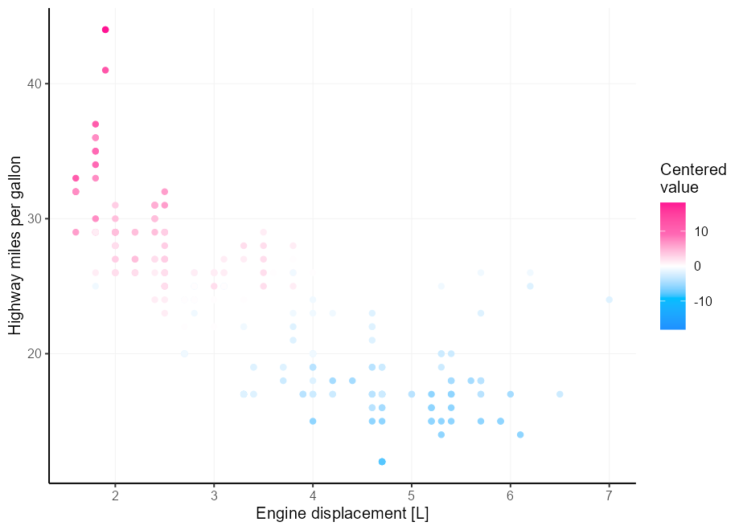
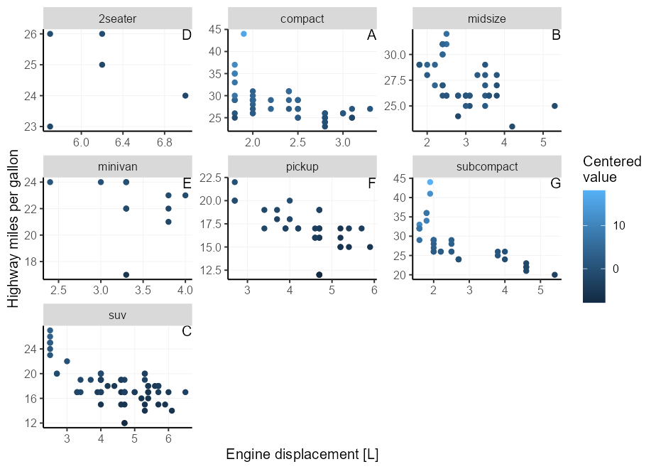
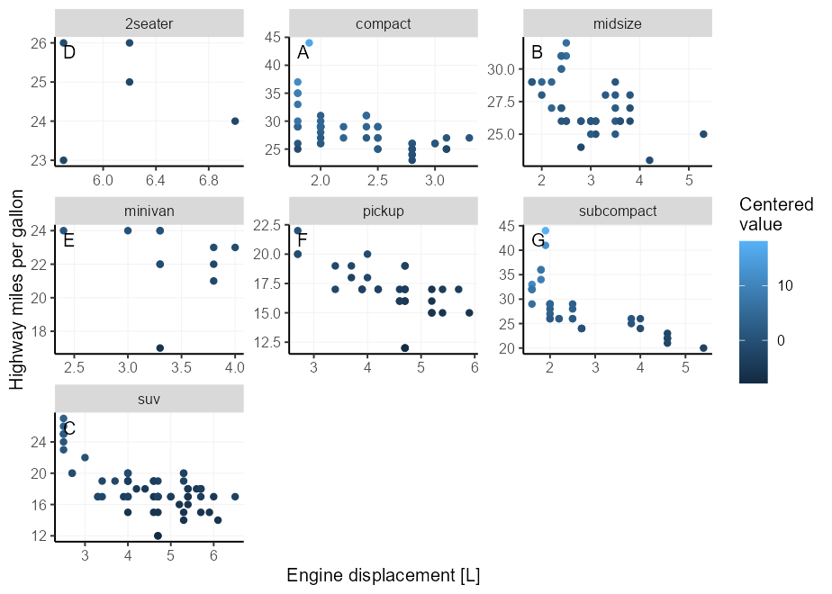

<!-- README.md is generated from README.Rmd. Please edit that file -->

# ggplot tricks

<!-- badges: start -->
<!-- badges: end -->

The goal of this repository is to keep track of some neat
[ggplot2](https://ggplot2.tidyverse.org/) tricks I’ve learned. This
assumes you’ve familiarised yourself with the basics of ggplot2 and can
construct some nice plots of your own. If not, please peruse the
[book](https://ggplot2-book.org/) at your leasure.

I’m not incredibly adapt in gloriously typesetting plots and expertly
finetuning themes and colour palettes, so you’d have to forgive me. The
`mpg` dataset is very versatile for plotting, so you’ll be seeing a lot
of that as you read on. Extension packages are great, and I’ve dabbled
myself, but I’ll try to limit myself to vanilla ggplot2 tricks here.

For now, this will be mostly a README-only bag of tricks, but I may
decide later to put them into separate groups in other files.

## Table of contents

1.  [Start-up](#let's-begin)
2.  [Half-geoms](#half-geoms)
    1.  [Half-boxplots](#half-boxplots)
    2.  [Half-errorbars](#half-errorbars)
    3.  [Half-violin](#half-violin)
    4.  [Combining](#combining)
3.  [Midpoints in diverging
    scales](#setting-midpoints-in-divergent-scales)
4.  [Facetted tags](#facetted-tags)

## Let’s begin

By loading the library and setting a plotting theme. The first trick
here is to use `theme_set()` to set a theme for *all* your plots
throughout a document. If you find yourself setting a very verbose theme
for every plot, here is the place where you set all your common
settings. Then never write a novel of theme elements ever again!

``` r
library(ggplot2)
library(scales)

theme_set(
  # Pick a starting theme
  theme_gray() +
  # Add your favourite elements
  theme(
    axis.line        = element_line(),
    panel.background = element_rect(fill = "white"),
    panel.grid.major = element_line("grey95", linewidth = 0.25),
    legend.key       = element_rect(fill = NA) 
  )
)
```

## Half-geoms

There are some extensions that offer half-geom versions of things. Of
the ones I know, [gghalves](https://erocoar.github.io/gghalves/) and the
[see](https://easystats.github.io/see/) package offer some half-geoms.

Here is how to abuse the [delayed evaluation
system](https://ggplot2.tidyverse.org/reference/aes_eval.html) to make
your own. This can come in handy if you’re not willing to take on an
extra dependency for just this feature.

### Half-boxplots

The easy case is the boxplot. You can either set `xmin` or `xmax` to
`after_scale(x)` to keep the right and left parts of a boxplot
respectively. This still works fine with `position = "dodge"`.

``` r
# A basic plot to reuse for examples
p <- ggplot(mpg, aes(class, displ, colour = class)) +
  guides(colour = "none", fill = "none") +
  labs(y = "Engine Displacement [L]", x = "Type of car")

p + geom_boxplot(aes(xmin = after_scale(x)))
```



### Half-errorbars

The same thing that works for boxplots, also works for errorbars.

``` r
p + geom_errorbar(
  stat = "summary",
  fun.data = mean_se,
  aes(xmin = after_scale(x))
)
```



### Half-violin

We can once again do the same thing for violin plots, but the layer
complains about not knowing about the `xmin` aesthetic. It does use that
aesthetic, but only after the data has been setup, so it is not
*intended* to be a user accessible aesthetic. We can silence the warning
by updating the `xmin` default to `NULL`, which means it won’t complain,
but also doesn’t use it if absent.

``` r
update_geom_defaults("violin", list(xmin = NULL))

p + geom_violin(aes(xmin = after_scale(x)))
```



### Combining

Not left as an exercise for the reader this time, but I just wanted to
show how it would work if you were to combine two halves and want them a
little bit offset from one another. We’ll abuse the errorbars to serve
as staples for the boxplots.

``` r
# A small nudge offset
offset <- 0.025

# We can pre-specify the mappings if we plan on recycling some
right_nudge <- aes(
  xmin = after_scale(x), 
  x = stage(class, after_stat = x + offset)
)
left_nudge  <- aes(
  xmax = after_scale(x),
  x = stage(class, after_stat = x - offset)
)

# Combining
p +
  geom_violin(right_nudge) +
  geom_boxplot(left_nudge) +
  geom_errorbar(left_nudge, stat = "boxplot", width = 0.3)
```



## Setting midpoints in divergent scales

Let’s say you have better colour intuition than I have, and three
colours aren’t enough for your divergent colour palette needs. A
painpoint is that it is tricky to get the midpoint right if your limits
aren’t perfectly centered around it. Enter the `rescaler` argument in
league with `scales::rescale_mid()`.

``` r
my_palette <- c("dodgerblue", "deepskyblue", "white", "hotpink", "deeppink")

p <- ggplot(mpg, aes(displ, hwy, colour = cty - mean(cty))) +
  geom_point() +
  labs(
    x = "Engine displacement [L]",
    y = "Highway miles per gallon",
    colour = "Centered\nvalue"
  )

p + 
  scale_colour_gradientn(
    colours = my_palette, 
    rescaler = ~ rescale_mid(.x, mid = 0)
  )
```



An alternative is to simply center the limits on x. We can do that by
providing a function to the scale’s limits.

``` r
p +
  scale_colour_gradientn(
    colours = my_palette, 
    limits = ~ c(-1, 1) * max(abs(.x))
  )
```



## Facetted tags

Putting text annotations on facetted plots is a pain, because limits can
vary on a per-panel basis, so it is very difficult to find the correct
position. An extension that explores alleviating this pain is the
[tagger](https://github.com/eliocamp/tagger) extension, but we can do a
similar thing in vanilla ggplot2.

Luckily, there is a mechanic in ggplot2’s position axes that let’s
`-Inf` and `Inf` be interpreted as the scale’s minimum and maximum limit
respectively. You can exploit this by choosing `x = Inf, y = Inf` to put
the labels in a corner. You can also use `-Inf` instead of `Inf` to
place at the bottom instead of top, or left instead of right.

We need to match the `hjust`/`vjust` arguments to the side of the plot.
For `x/y = Inf`, they would need to be `hjust/vjust = 1`, and for
`x/y = -Inf` they need to be `hjust/vjust = 0`.

``` r
p + facet_wrap(~ class, scales = "free") +
  geom_text(
    # We only need 1 row per facet, so we deduplicate the facetting variable
    data = ~ subset(.x, !duplicated(class)),
    aes(x = Inf, y = Inf, label = LETTERS[seq_along(class)]),
    hjust = 1, vjust = 1,
    colour = "black"
  )
```



Unfortunately, this places the text straight at the border of the panel,
which may offend our sense of beauty. We can get slightly fancier by
using `geom_label()`, which lets us more precisely control the spacing
between the text and the panel borders by setting the `label.padding`
argument.

Moreover, we can use `label.size = NA, fill = NA` to hide the textbox
part of the geom. For illustration purposes, we now place the tag at the
top-left instead of top-right.

``` r
p + facet_wrap(~ class, scales = "free") +
  geom_label(
    data = ~ subset(.x, !duplicated(class)),
    aes(x = -Inf, y = Inf, label = LETTERS[seq_along(class)]),
    hjust = 0, vjust = 1, label.size = NA, fill = NA,
    label.padding = unit(5, "pt"),
    colour = "black"
  )
```



<details style="margin-bottom:10px;">
<summary>
Session info
</summary>

    #> ─ Session info ───────────────────────────────────────────────────────────────
    #>  setting  value
    #>  version  R version 4.2.2 (2022-10-31 ucrt)
    #>  os       Windows 10 x64 (build 22000)
    #>  system   x86_64, mingw32
    #>  ui       RTerm
    #>  language (EN)
    #>  collate  English_United Kingdom.utf8
    #>  ctype    English_United Kingdom.utf8
    #>  tz       Europe/Berlin
    #>  date     2023-01-22
    #>  pandoc   2.19.2
    #> 
    #> ─ Packages ───────────────────────────────────────────────────────────────────
    #>  package     * version date (UTC) lib source
    #>  assertthat    0.2.1   2019-03-21 []  CRAN (R 4.2.0)
    #>  cli           3.4.1   2022-09-23 []  CRAN (R 4.2.2)
    #>  colorspace    2.0-3   2022-02-21 []  CRAN (R 4.2.0)
    #>  DBI           1.1.3   2022-06-18 []  CRAN (R 4.2.2)
    #>  digest        0.6.29  2021-12-01 []  CRAN (R 4.2.0)
    #>  dplyr         1.0.10  2022-09-01 []  CRAN (R 4.2.1)
    #>  evaluate      0.19    2022-12-13 []  CRAN (R 4.2.2)
    #>  fansi         1.0.3   2022-03-24 []  CRAN (R 4.2.0)
    #>  farver        2.1.1   2022-07-06 []  CRAN (R 4.2.1)
    #>  fastmap       1.1.0   2021-01-25 []  CRAN (R 4.2.0)
    #>  generics      0.1.3   2022-07-05 []  CRAN (R 4.2.1)
    #>  ggplot2     * 3.4.0   2022-11-04 []  CRAN (R 4.2.2)
    #>  glue          1.6.2   2022-02-24 []  CRAN (R 4.2.0)
    #>  gtable        0.3.1   2022-09-01 []  CRAN (R 4.2.1)
    #>  highr         0.10    2022-12-22 []  CRAN (R 4.2.2)
    #>  htmltools     0.5.4   2022-12-07 []  CRAN (R 4.2.2)
    #>  knitr         1.41    2022-11-18 []  CRAN (R 4.2.2)
    #>  labeling      0.4.2   2020-10-20 []  CRAN (R 4.2.0)
    #>  lifecycle     1.0.3   2022-10-07 []  CRAN (R 4.2.2)
    #>  magrittr      2.0.3   2022-03-30 []  CRAN (R 4.2.0)
    #>  munsell       0.5.0   2018-06-12 []  CRAN (R 4.2.0)
    #>  pillar        1.8.1   2022-08-19 []  CRAN (R 4.2.1)
    #>  pkgconfig     2.0.3   2019-09-22 []  CRAN (R 4.2.0)
    #>  R6            2.5.1   2021-08-19 []  CRAN (R 4.2.0)
    #>  ragg          1.2.2   2022-02-21 []  CRAN (R 4.2.0)
    #>  rlang         1.0.6   2022-09-24 []  CRAN (R 4.2.1)
    #>  rmarkdown     2.19    2022-12-15 []  CRAN (R 4.2.2)
    #>  rstudioapi    0.14    2022-08-22 []  CRAN (R 4.2.2)
    #>  scales      * 1.2.1   2022-08-20 []  CRAN (R 4.2.2)
    #>  sessioninfo   1.2.2   2021-12-06 []  CRAN (R 4.2.0)
    #>  stringi       1.7.6   2021-11-29 []  CRAN (R 4.2.0)
    #>  stringr       1.5.0   2022-12-02 []  CRAN (R 4.2.2)
    #>  systemfonts   1.0.4   2022-02-11 []  CRAN (R 4.2.0)
    #>  textshaping   0.3.6   2021-10-13 []  CRAN (R 4.2.0)
    #>  tibble        3.1.8   2022-07-22 []  CRAN (R 4.2.1)
    #>  tidyselect    1.2.0   2022-10-10 []  CRAN (R 4.2.2)
    #>  utf8          1.2.2   2021-07-24 []  CRAN (R 4.2.0)
    #>  vctrs         0.5.0   2022-10-22 []  CRAN (R 4.2.2)
    #>  withr         2.5.0   2022-03-03 []  CRAN (R 4.2.0)
    #>  xfun          0.36    2022-12-21 []  CRAN (R 4.2.2)
    #>  yaml          2.3.5   2022-02-21 []  CRAN (R 4.2.0)
    #> 
    #> 
    #> ──────────────────────────────────────────────────────────────────────────────

</details>
