<!-- README.md is generated from README.Rmd. Please edit that file -->

# ggplot tricks

<!-- badges: start -->
<!-- badges: end -->

The goal of this repository is to keep track of some neat
[ggplot2](https://ggplot2.tidyverse.org/) tricks I’ve learned. This
assumes you’ve familiarised yourself with the basics of ggplot2 and can
construct some nice plots of your own. If not, please peruse the
[book](https://ggplot2-book.org/) at your leasure.

I’m not incredibly adapt in gloriously typesetting plots and expertly
finetuning themes and colour palettes, so you’d have to forgive me. The
`mpg` dataset is very versatile for plotting, so you’ll be seeing a lot
of that as you read on. Extension packages are great, and I’ve dabbled
myself, but I’ll try to limit myself to vanilla ggplot2 tricks here.

For now, this will be mostly a README-only bag of tricks, but I may
decide later to put them into separate groups in other files.

## Table of contents

1.  [Start-up](#let's-begin)
2.  [Splicing aesthetics](#splicing-aesthetics)
    1.  [Colour-fill relations](#relating-colour-and-fill)
    2.  [Text contrast](#text-contrast)
3.  [Half-geoms](#half-geoms)
    1.  [Half-boxplots](#half-boxplots)
    2.  [Half-errorbars](#half-errorbars)
    3.  [Half-violin](#half-violin)
    4.  [Combining](#combining)
4.  [Midpoints in diverging
    scales](#setting-midpoints-in-divergent-scales)
5.  [Facetted tags](#facetted-tags)
6.  [Recycling plots](#recycling-plots)
    1.  [Functions](#functions)
    2.  [Skeletons](#skeletons)
    3.  [Ribcage](#ribcage)

## Let’s begin

By loading the library and setting a plotting theme. The first trick
here is to use `theme_set()` to set a theme for *all* your plots
throughout a document. If you find yourself setting a very verbose theme
for every plot, here is the place where you set all your common
settings. Then never write a novel of theme elements ever again[^1]!

``` r
library(ggplot2)
library(scales)

theme_set(
  # Pick a starting theme
  theme_gray() +
  # Add your favourite elements
  theme(
    axis.line        = element_line(),
    panel.background = element_rect(fill = "white"),
    panel.grid.major = element_line("grey95", linewidth = 0.25),
    legend.key       = element_rect(fill = NA) 
  )
)
```

## Splicing aesthetics

The `?aes` documentation doesn’t tell you this, but you can splice the
`mapping` argument in ggplot2. What does that mean? Well it means that
you can compose the `mapping` argument on the go with `!!!`. This is
especially nifty if you need to recycle aesthetics every once in a
while.

``` r
my_mapping <- aes(x = foo, y = bar)

aes(colour = qux, !!!my_mapping)
#> Aesthetic mapping: 
#> * `x`      -> `foo`
#> * `y`      -> `bar`
#> * `colour` -> `qux`
```

### Relating colour and fill

My personal favourite use of this is to make the `fill` colour match the
`colour` colour, but slightly lighter[^2]. We’ll use the delayed
evaluation system for this, `after_scale()` in this case, which you’ll
see more of in the section following this one. I’ll repeat this trick a
couple of times throughout this document.

``` r
my_fill <- aes(fill = after_scale(alpha(colour, 0.3)))

ggplot(mpg, aes(displ, hwy)) +
  geom_point(aes(colour = factor(cyl), !!!my_fill), shape = 21)
```

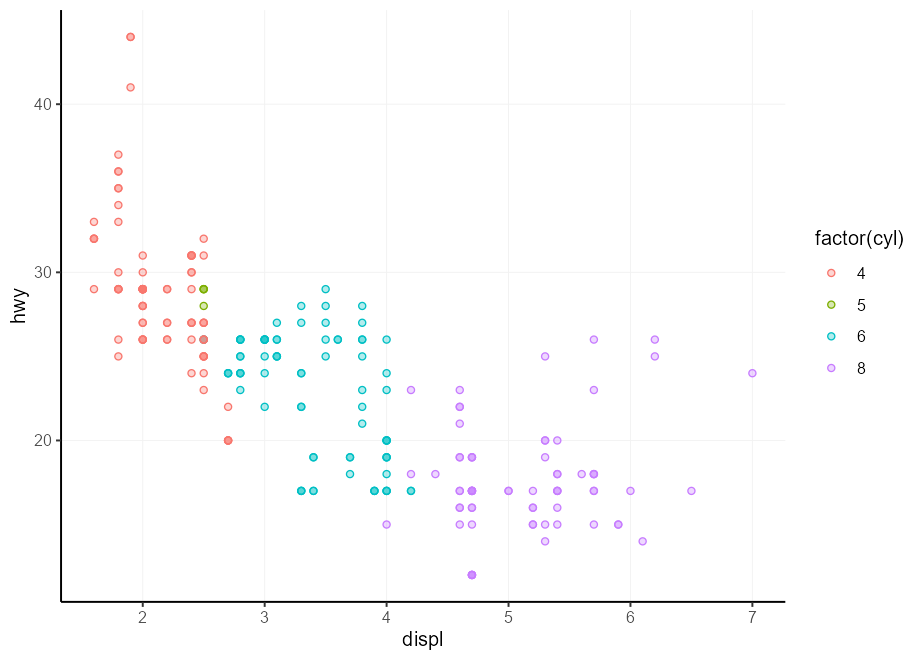

### Text contrast

You may find yourself in a situation wherein you’re asked to make a
heatmap of a small number of variables. Typically, sequential scales run
from light to dark or vice versa, which makes text in a single colour
hard to read. We could devise a method to automatically write the text
in white on a dark background, and black on a light background. The
function below considers a lightness value for a colour, and returns
either black or white depending on that lightness.

``` r
contrast <- function(colour) {
  out   <- rep("black", length(colour))
  light <- farver::get_channel(colour, "l", space = "hcl")
  out[light < 50] <- "white"
  out
}
```

Now, we can make an aesthetic to be spliced into a layer’s `mapping`
argument on demand.

``` r
autocontrast <- aes(colour = after_scale(contrast(fill)))
```

Lastly, we can test out our automatic contrast contraption. You may
notice that it adapts to the scale, so you wouldn’t need to do a bunch
of conditional formatting for this.

``` r
cors <- cor(mtcars)

# Melt matrix
df <- data.frame(
  col = colnames(cors)[as.vector(col(cors))],
  row = rownames(cors)[as.vector(row(cors))],
  value = as.vector(cors)
)

# Basic plot
p <- ggplot(df, aes(row, col, fill = value)) +
  geom_raster() +
  geom_text(aes(label = round(value, 2), !!!autocontrast)) +
  coord_equal()

p + scale_fill_viridis_c(direction =  1)
p + scale_fill_viridis_c(direction = -1)
```

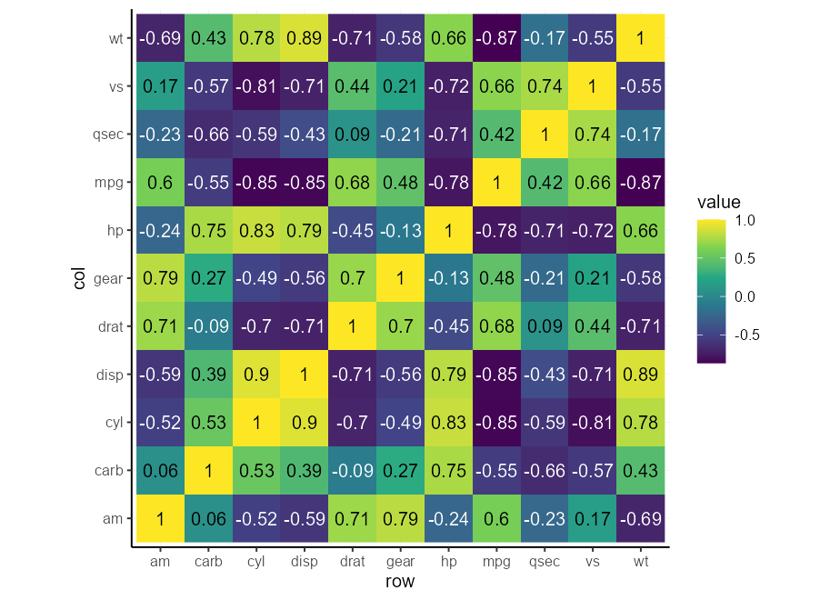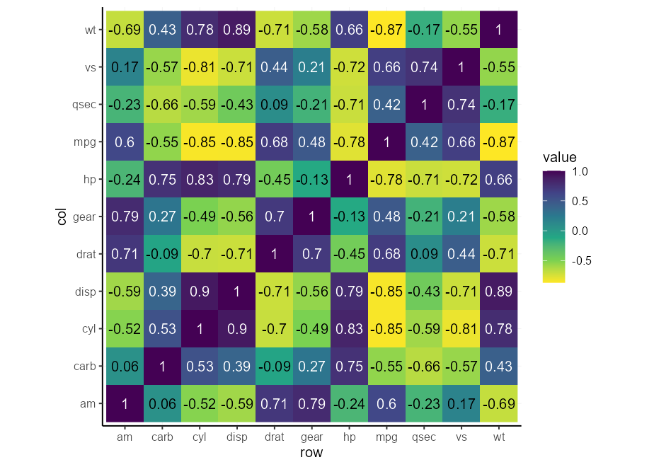

## Half-geoms

There are some extensions that offer half-geom versions of things. Of
the ones I know, [gghalves](https://erocoar.github.io/gghalves/) and the
[see](https://easystats.github.io/see/) package offer some half-geoms.

Here is how to abuse the [delayed evaluation
system](https://ggplot2.tidyverse.org/reference/aes_eval.html) to make
your own. This can come in handy if you’re not willing to take on an
extra dependency for just this feature.

### Half-boxplots

The easy case is the boxplot. You can either set `xmin` or `xmax` to
`after_scale(x)` to keep the right and left parts of a boxplot
respectively. This still works fine with `position = "dodge"`.

``` r
# A basic plot to reuse for examples
p <- ggplot(mpg, aes(class, displ, colour = class, !!!my_fill)) +
  guides(colour = "none", fill = "none") +
  labs(y = "Engine Displacement [L]", x = "Type of car")

p + geom_boxplot(aes(xmin = after_scale(x)))
```


### Half-errorbars

The same thing that works for boxplots, also works for errorbars.

``` r
p + geom_errorbar(
  stat = "summary",
  fun.data = mean_se,
  aes(xmin = after_scale(x))
)
```


### Half-violin

We can once again do the same thing for violin plots, but the layer
complains about not knowing about the `xmin` aesthetic. It does use that
aesthetic, but only after the data has been setup, so it is not
*intended* to be a user accessible aesthetic. We can silence the warning
by updating the `xmin` default to `NULL`, which means it won’t complain,
but also doesn’t use it if absent.

``` r
update_geom_defaults("violin", list(xmin = NULL))

p + geom_violin(aes(xmin = after_scale(x)))
```


### Combining

Not left as an exercise for the reader this time, but I just wanted to
show how it would work if you were to combine two halves and want them a
little bit offset from one another. We’ll abuse the errorbars to serve
as staples for the boxplots.

``` r
# A small nudge offset
offset <- 0.025

# We can pre-specify the mappings if we plan on recycling some
right_nudge <- aes(
  xmin = after_scale(x), 
  x = stage(class, after_stat = x + offset)
)
left_nudge  <- aes(
  xmax = after_scale(x),
  x = stage(class, after_stat = x - offset)
)

# Combining
p +
  geom_violin(right_nudge) +
  geom_boxplot(left_nudge) +
  geom_errorbar(left_nudge, stat = "boxplot", width = 0.3)
```


## Setting midpoints in divergent scales

Let’s say you have better colour intuition than I have, and three
colours aren’t enough for your divergent colour palette needs. A
painpoint is that it is tricky to get the midpoint right if your limits
aren’t perfectly centered around it. Enter the `rescaler` argument in
league with `scales::rescale_mid()`.

``` r
my_palette <- c("dodgerblue", "deepskyblue", "white", "hotpink", "deeppink")

p <- ggplot(mpg, aes(displ, hwy, colour = cty - mean(cty))) +
  geom_point() +
  labs(
    x = "Engine displacement [L]",
    y = "Highway miles per gallon",
    colour = "Centered\nvalue"
  )

p + 
  scale_colour_gradientn(
    colours = my_palette, 
    rescaler = ~ rescale_mid(.x, mid = 0)
  )
```


An alternative is to simply center the limits on x. We can do that by
providing a function to the scale’s limits.

``` r
p +
  scale_colour_gradientn(
    colours = my_palette, 
    limits = ~ c(-1, 1) * max(abs(.x))
  )
```


## Using `geom_label()` as text

### Labelling points

You can label points with `geom_text()`, but a potential problem is that
the text and points overlap.

``` r
set.seed(0)
df <- USArrests[sample(nrow(USArrests), 5), ]
df$state <- rownames(df)

q <- ggplot(df, aes(Murder, Rape, label = state)) +
  geom_point()
q + geom_text()
```

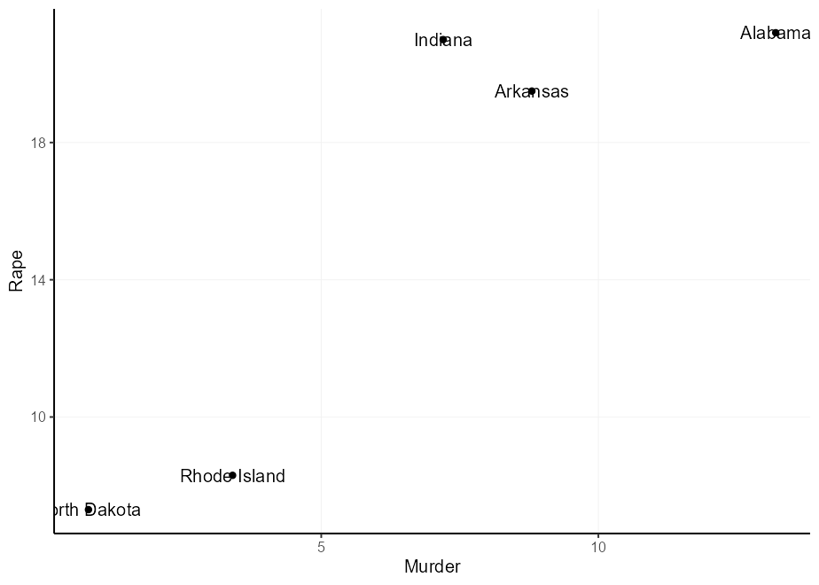

There are several solutions to this problem, and they all come with
drawbacks:

- The [{ggrepel}](https://ggrepel.slowkow.com/) package is wonderful for
  solving this problem. But if you try to keep your dependencies to a
  minimum, you might not want to depend on it.
- You can set the `nudge_x` and `nudge_y` parameters. The issue here is
  that these are defined in data units, so spacing is unpredictable, and
  there is no way to have these depend on the original locations.
- You can set the `hjust` and `vjust` aesthetics. It allows you to
  depend on the original locations, but these have no natural offsets.

Here are options 1 and 2 in action:

``` r
q + geom_text(nudge_x = 1, nudge_y = 1)

q + geom_text(aes(
  hjust = Murder > mean(Murder),
  vjust = Rape > mean(Rape)
))
```

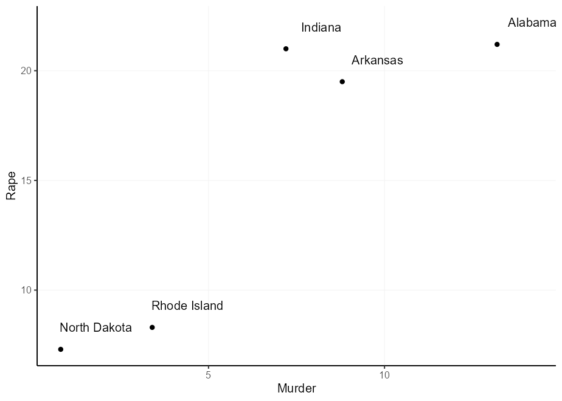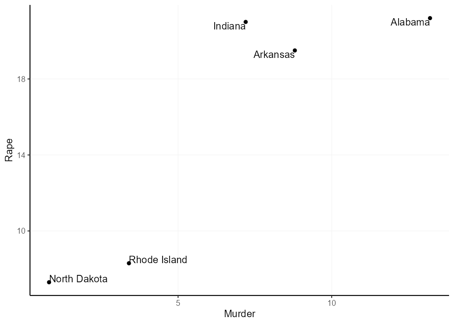

You might think: ‘I can just multiply the justifications to get a wider
offset’, and you’d be right. However, because the justification depends
on the size of text you might get unequal offsets. Notice in the plot
below that ‘North Dakota’ is offset too munch in the y-direction and
‘Rhode Island’ in the x-direction.

``` r
q + geom_text(aes(
  label = gsub("North Dakota", "North\nDakota", state),
  hjust = ((Murder > mean(Murder)) - 0.5) * 1.5 + 0.5,
  vjust = ((Rape > mean(Rape)) - 0.5) * 3 + 0.5
))
```


The nice thing of `geom_label()` is that you can turn off the label box
and keep the text. That way, you can continue to use other useful stuff,
like the `label.padding` setting, to give an absolute (data-independent)
offset from the text to the label.

``` r
q + geom_label(
  aes(
    label = gsub(" ", "\n", state),
    hjust = Murder > mean(Murder),
    vjust = Rape > mean(Rape)
  ),
  label.padding = unit(5, "pt"),
  label.size = NA, fill = NA
)
```

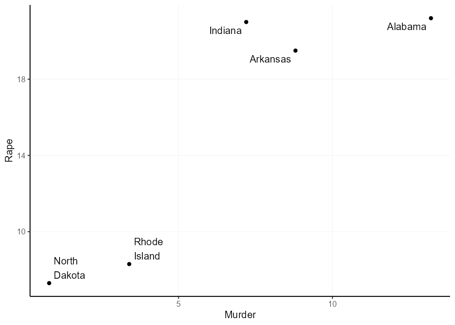

### Facetted tags

This used to be a tip about putting facet tags in panels, which used to
be complicated. With ggplot2 3.5.0, you no longer have to fiddle with
setting infinite positions and tweaking the `hjust` or `vjust`
parameters. You can now just use `x = I(0.95), y = I(0.95)` to place
text in the upper-right corner. Open up the details to see the old tip.

<details>

Putting text annotations on facetted plots is a pain, because limits can
vary on a per-panel basis, so it is very difficult to find the correct
position. An extension that explores alleviating this pain is the
[tagger](https://github.com/eliocamp/tagger) extension, but we can do a
similar thing in vanilla ggplot2.

Luckily, there is a mechanic in ggplot2’s position axes that let’s
`-Inf` and `Inf` be interpreted as the scale’s minimum and maximum limit
respectively[^3]. You can exploit this by choosing `x = Inf, y = Inf` to
put the labels in a corner. You can also use `-Inf` instead of `Inf` to
place at the bottom instead of top, or left instead of right.

We need to match the `hjust`/`vjust` arguments to the side of the plot.
For `x/y = Inf`, they would need to be `hjust/vjust = 1`, and for
`x/y = -Inf` they need to be `hjust/vjust = 0`.

``` r
p + facet_wrap(~ class, scales = "free") +
  geom_text(
    # We only need 1 row per facet, so we deduplicate the facetting variable
    data = ~ subset(.x, !duplicated(class)),
    aes(x = Inf, y = Inf, label = LETTERS[seq_along(class)]),
    hjust = 1, vjust = 1,
    colour = "black"
  )
```


Unfortunately, this places the text straight at the border of the panel,
which may offend our sense of beauty. We can get slightly fancier by
using `geom_label()`, which lets us more precisely control the spacing
between the text and the panel borders by setting the `label.padding`
argument.

Moreover, we can use `label.size = NA, fill = NA` to hide the textbox
part of the geom. For illustration purposes, we now place the tag at the
top-left instead of top-right.

``` r
p + facet_wrap(~ class, scales = "free") +
  geom_label(
    data = ~ subset(.x, !duplicated(class)),
    aes(x = -Inf, y = Inf, label = LETTERS[seq_along(class)]),
    hjust = 0, vjust = 1, label.size = NA, fill = NA,
    label.padding = unit(5, "pt"),
    colour = "black"
  )
```


</details>

## Recycling plots

Let’s say we’re tasked with making a bunch of similar plots, with
different datasets and columns. For example, we might want to make a
series of barplots[^4] with some specific pre-sets: we’d like the bars
to touch the x-axis and not draw vertical gridlines.

### Functions

One well-known way to make a bunch of similar plots is to wrap the plot
construction into a function. That way, you can use encode all the
presets you want in your function.

I case you might not know, there are various methods to [program with
the `aes()`
function](https://ggplot2.tidyverse.org/articles/ggplot2-in-packages.html#using-aes-and-vars-in-a-package-function),
and using `{{ }}` (curly-curly) is one of the more flexible ways [^5].

``` r
barplot_fun <- function(data, x) {
  ggplot(data, aes(x = {{ x }})) +
    geom_bar(width = 0.618) +
    scale_y_continuous(expand = c(0, 0, 0.05, 0)) +
    theme(panel.grid.major.x = element_blank())
}

barplot_fun(mpg, class)
```

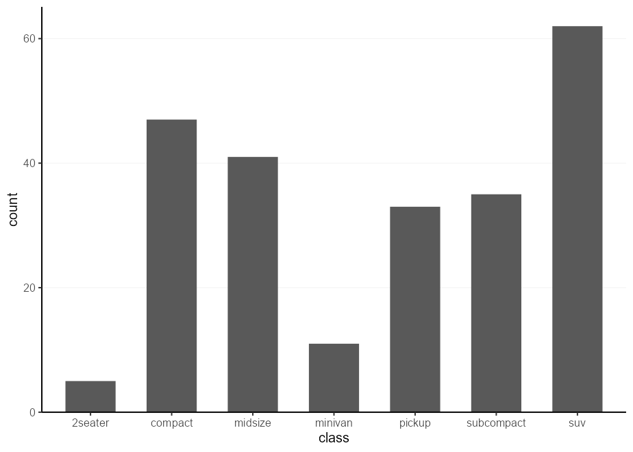

One drawback of this approach is that you lock-in any aesthetics in the
function arguments. To go around this, an even simpler way is to simply
pass `...` directly to `aes()`.

``` r
barplot_fun <- function(data, ...) {
  ggplot(data, aes(...)) +
    geom_bar(width = 0.618) +
    scale_y_continuous(expand = c(0, 0, 0.1, 0)) +
    theme(panel.grid.major.x = element_blank())
}

barplot_fun(mpg, class, colour = factor(cyl), !!!my_fill)
```

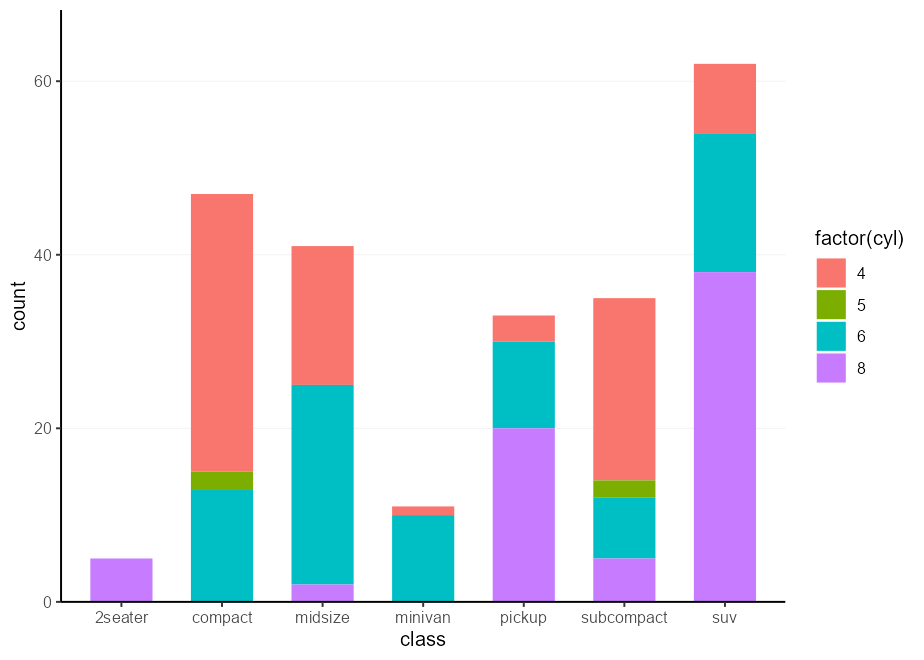

### Skeletons

Another method of doing a very similar thing, is to use plot
‘skeletons’. The idea behind a skeleton is that you can build a plot,
with or without any `data` argument, and add in the specifics later.
Then, when you actually want to make a plot, you can use the `%+%` to
fill in or replace the dataset, and `+ aes(...)` to set the relevant
aesthetics.

``` r
barplot_skelly <- ggplot() +
  geom_bar(width = 0.618) +
  scale_y_continuous(expand = c(0, 0, 0.1, 0)) +
  theme(panel.grid.major.x = element_blank())

my_plot <- barplot_skelly %+% mpg + 
  aes(class, colour = factor(cyl), !!!my_fill) 
my_plot
```


One neat thing about these skeletons is that even when you’ve already
filled in the `data` and `mapping` arguments, you can just replace them
again and again.

``` r
my_plot %+% mtcars + 
  aes(factor(carb), colour = factor(cyl), !!!my_fill)
```

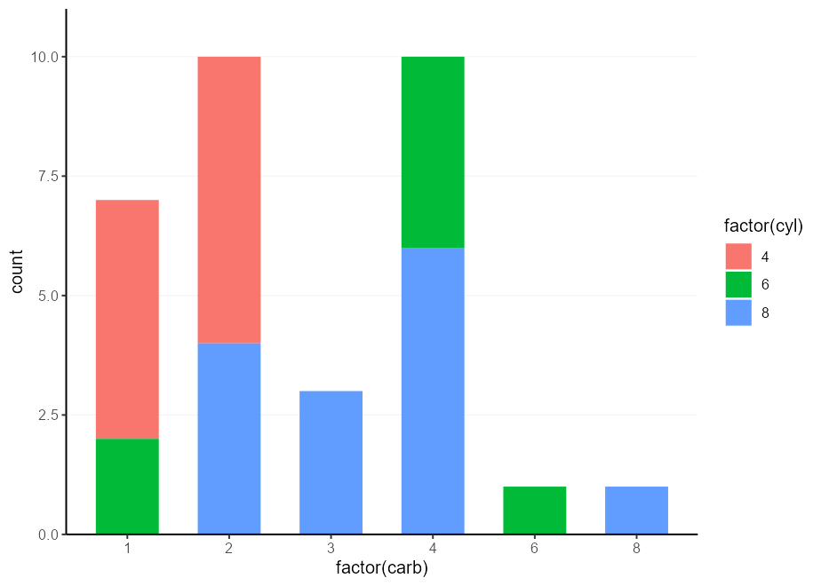

### Ribcage[^6]

The idea here is to not skeletonise the entire plot, but just a
frequently re-used set of parts. For example, we might want to label our
barplot, and pack together all the things that make up a labelled
barplot. The trick to this is to *not* add these components together
with `+`, but simply put them in a `list()`. You can then `+` your list
together with the main plot call.

``` r
labelled_bars <- list(
  geom_bar(my_fill, width = 0.618),
  geom_text(
    stat = "count",
    aes(y     = after_stat(count), 
        label = after_stat(count), 
        fill  = NULL, colour = NULL),
    vjust = -1, show.legend = FALSE
  ),
  scale_y_continuous(expand = c(0, 0, 0.1, 0)),
  theme(panel.grid.major.x = element_blank())
)

ggplot(mpg, aes(class, colour = factor(cyl))) +
  labelled_bars +
  ggtitle("The `mpg` dataset")

ggplot(mtcars, aes(factor(carb), colour = factor(cyl))) +
  labelled_bars +
  ggtitle("The `mtcars` dataset")
```

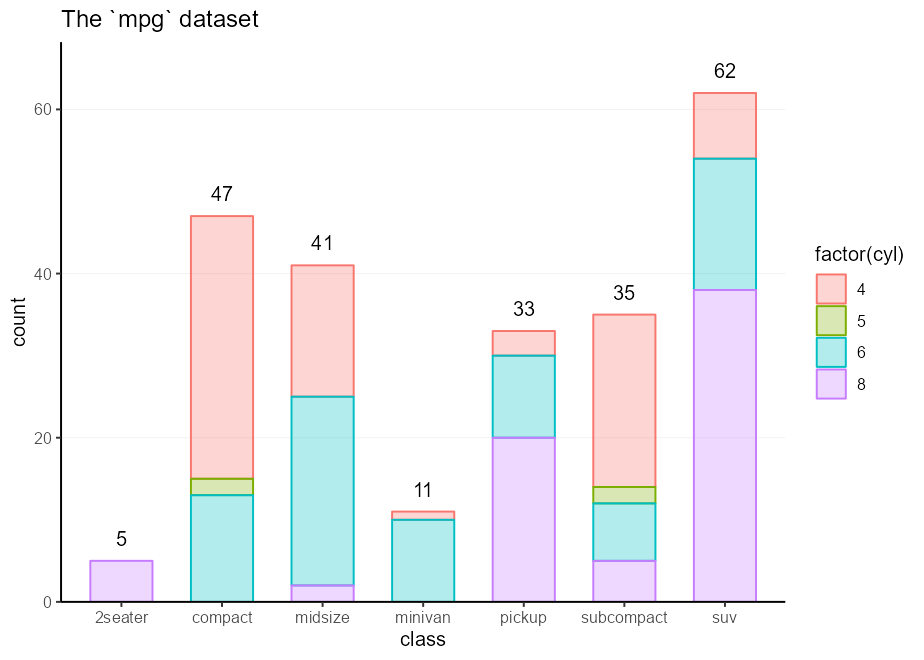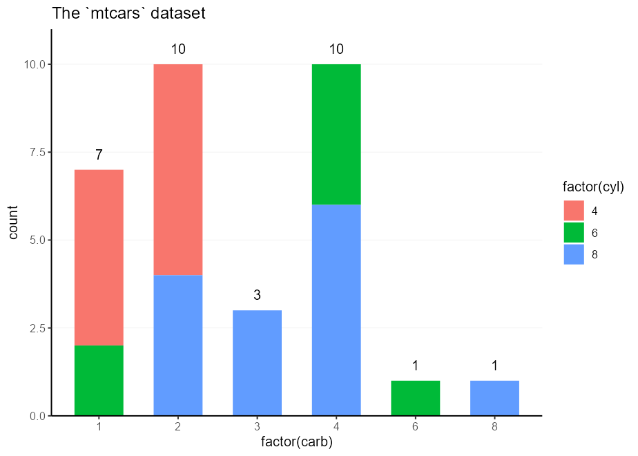

<details style="margin-bottom:10px;">
<summary>
Session info
</summary>

    #> ─ Session info ───────────────────────────────────────────────────────────────
    #>  setting  value
    #>  version  R version 4.3.2 (2023-10-31 ucrt)
    #>  os       Windows 11 x64 (build 22631)
    #>  system   x86_64, mingw32
    #>  ui       RTerm
    #>  language (EN)
    #>  collate  English_Netherlands.utf8
    #>  ctype    English_Netherlands.utf8
    #>  tz       Europe/Amsterdam
    #>  date     2024-02-27
    #>  pandoc   3.1.1
    #> 
    #> ─ Packages ───────────────────────────────────────────────────────────────────
    #>  package     * version    date (UTC) lib source
    #>  cli           3.6.2      2023-12-11 []  CRAN (R 4.3.2)
    #>  colorspace    2.1-0      2023-01-23 []  CRAN (R 4.3.2)
    #>  digest        0.6.34     2024-01-11 []  CRAN (R 4.3.2)
    #>  dplyr         1.1.4      2023-11-17 []  CRAN (R 4.3.2)
    #>  evaluate      0.23       2023-11-01 []  CRAN (R 4.3.2)
    #>  fansi         1.0.6      2023-12-08 []  CRAN (R 4.3.2)
    #>  farver        2.1.1      2022-07-06 []  CRAN (R 4.3.2)
    #>  fastmap       1.1.1      2023-02-24 []  CRAN (R 4.3.2)
    #>  generics      0.1.3      2022-07-05 []  CRAN (R 4.3.2)
    #>  ggplot2     * 3.5.0.9000 2024-02-27 []  local
    #>  glue          1.7.0      2024-01-09 []  CRAN (R 4.3.2)
    #>  gtable        0.3.4      2023-08-21 []  CRAN (R 4.3.2)
    #>  highr         0.10       2022-12-22 []  CRAN (R 4.3.2)
    #>  htmltools     0.5.7      2023-11-03 []  CRAN (R 4.3.2)
    #>  knitr         1.45       2023-10-30 []  CRAN (R 4.3.2)
    #>  labeling      0.4.3      2023-08-29 []  CRAN (R 4.3.1)
    #>  lifecycle     1.0.4      2023-11-07 []  CRAN (R 4.3.2)
    #>  magrittr      2.0.3      2022-03-30 []  CRAN (R 4.3.2)
    #>  munsell       0.5.0      2018-06-12 []  CRAN (R 4.3.2)
    #>  pillar        1.9.0      2023-03-22 []  CRAN (R 4.3.2)
    #>  pkgconfig     2.0.3      2019-09-22 []  CRAN (R 4.3.2)
    #>  R6            2.5.1      2021-08-19 []  CRAN (R 4.3.2)
    #>  ragg          1.2.7      2023-12-11 []  CRAN (R 4.3.2)
    #>  rlang         1.1.3      2024-01-10 []  CRAN (R 4.3.2)
    #>  rmarkdown     2.25       2023-09-18 []  CRAN (R 4.3.2)
    #>  rstudioapi    0.15.0     2023-07-07 []  CRAN (R 4.3.2)
    #>  scales      * 1.3.0      2023-11-28 []  CRAN (R 4.3.2)
    #>  sessioninfo   1.2.2      2021-12-06 []  CRAN (R 4.3.2)
    #>  systemfonts   1.0.5      2023-10-09 []  CRAN (R 4.3.2)
    #>  textshaping   0.3.7      2023-10-09 []  CRAN (R 4.3.2)
    #>  tibble        3.2.1      2023-03-20 []  CRAN (R 4.3.2)
    #>  tidyselect    1.2.0      2022-10-10 []  CRAN (R 4.3.2)
    #>  utf8          1.2.4      2023-10-22 []  CRAN (R 4.3.2)
    #>  vctrs         0.6.5      2023-12-01 []  CRAN (R 4.3.2)
    #>  viridisLite   0.4.2      2023-05-02 []  CRAN (R 4.3.2)
    #>  withr         3.0.0      2024-01-16 []  CRAN (R 4.3.2)
    #>  xfun          0.41       2023-11-01 []  CRAN (R 4.3.2)
    #>  yaml          2.3.8      2023-12-11 []  CRAN (R 4.3.2)
    #> 
    #> 
    #> ──────────────────────────────────────────────────────────────────────────────

</details>

[^1]: Well, you need to do it once at the start of your document. But
    then never again! Except in your next document. Just write a
    `plot_defaults.R` script and `source()` that from your document.
    Copy-paste that script for every project. Then, truly, *never* again
    :heart:.

[^2]: This is a lie. In reality, I use
    `aes(colour = after_scale(colorspace::darken(fill, 0.3)))` instead
    of lightening the fill. I didn’t want this README to have a
    dependency on {colorspace} though.

[^3]: Unless you self-sabotage your plots by setting
    `oob = scales::oob_censor_any` in the scale for example.

[^4]: In your soul of souls, do you *really* want to make a bunch of
    barplots though?

[^5]: The alternative is to use the `.data` pronoun, which can be
    `.data$var` if you want to lock in that column in advance, or
    `.data[[var]]` when `var` is passed as a character.

[^6]: This bit was originally called ‘partial skeleton’, but as a
    ribcage is a part of a skeleton, this title sounded more evocative.
